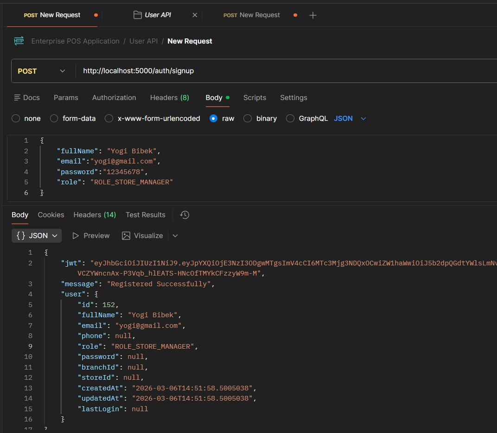
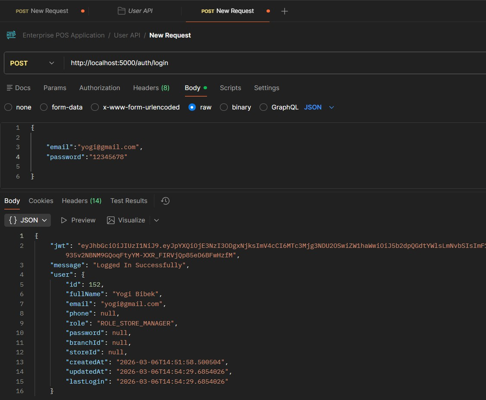
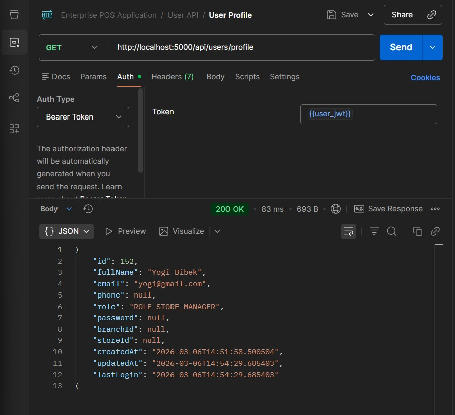
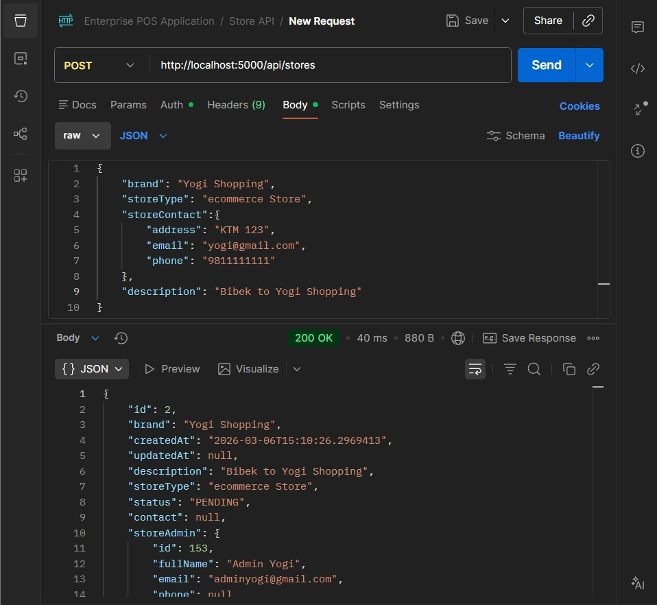
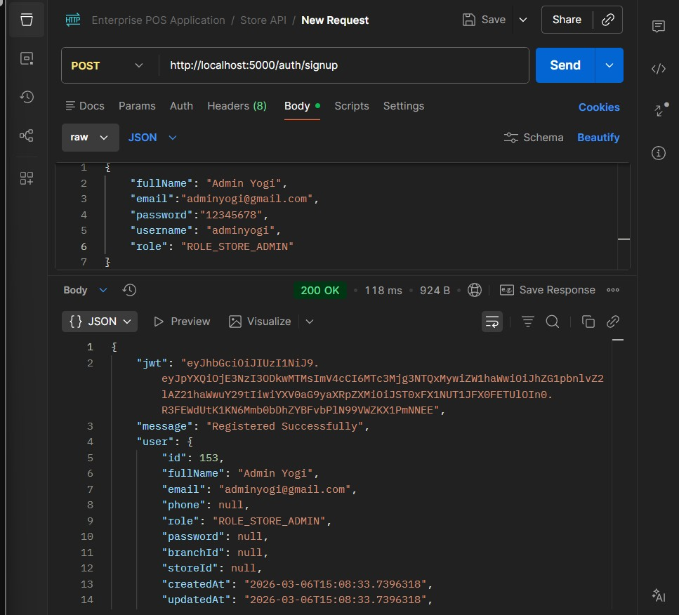
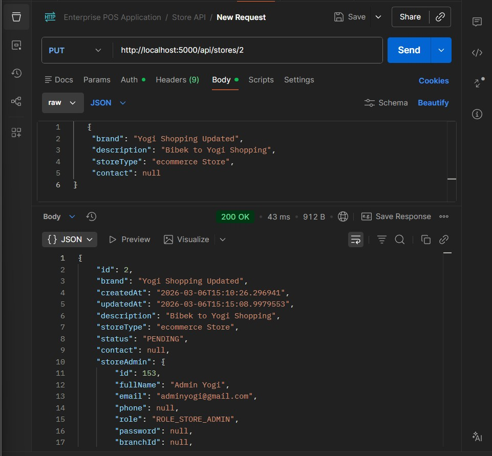
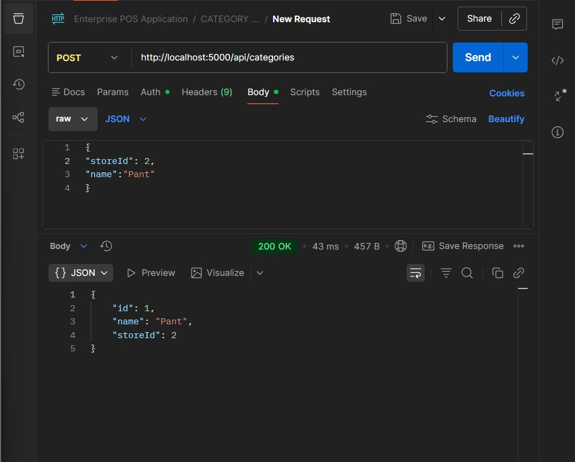
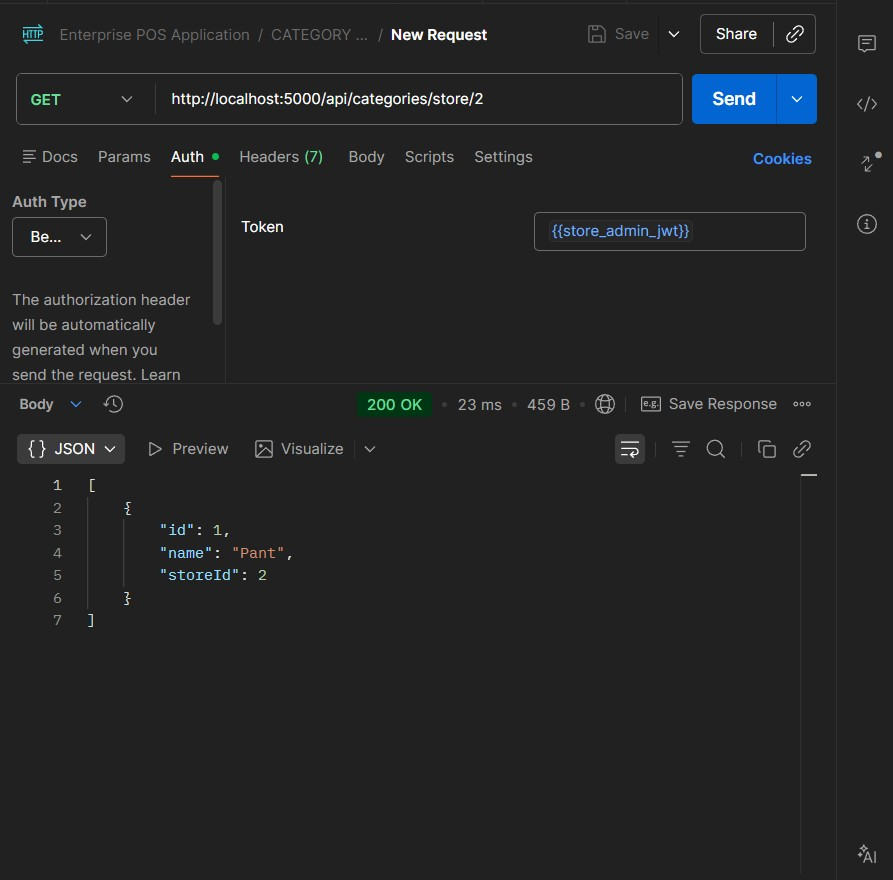
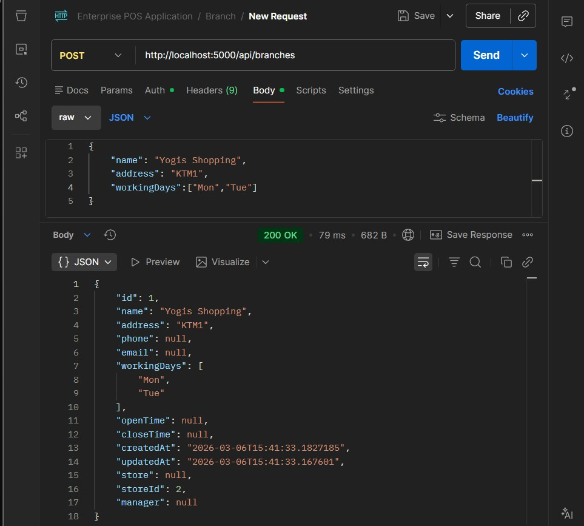
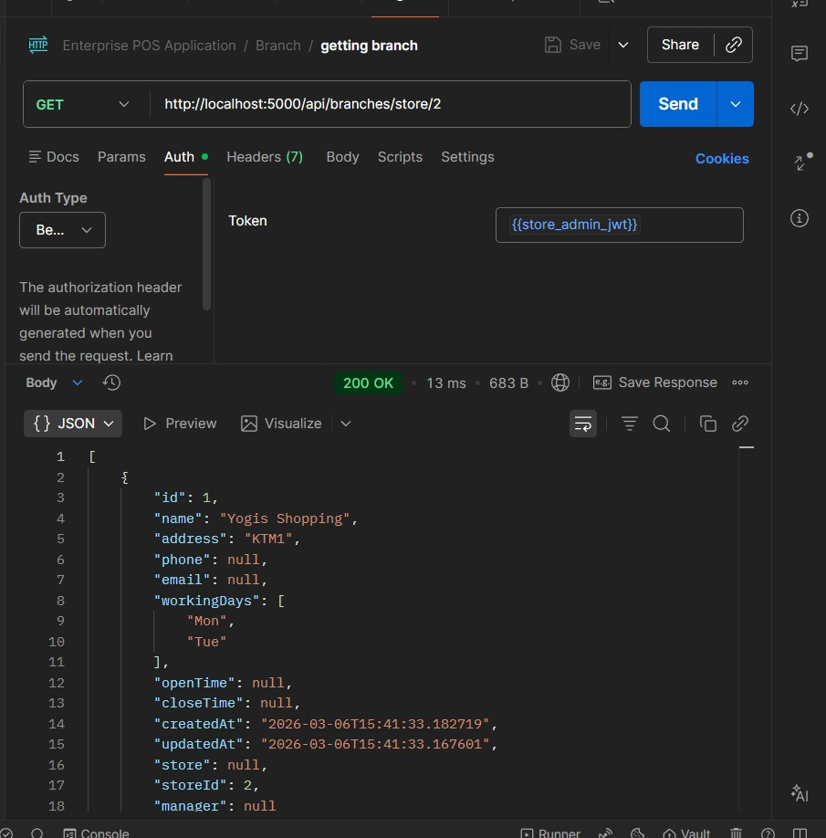

Enterprise POS System - Backend API

📋 Overview
A complete production-ready Enterprise SaaS Point of Sale (POS) System Backend built with Java Spring Boot. This REST API powers multi-tenant POS applications used in malls, supermarkets, and retail chains worldwide.

✅ Full Backend Implementation Complete - 14+ API modules fully developed and tested

## 📸 API Testing - Quick Preview

Here are some sample API test screenshots. You can test all endpoints using Postman collection.

### 🔐 Authentication APIs
| | |
|:---:|:---:|
|  |  |
| *User Signup API* | *User Login API* |
|  | |
| *Get User Profile API* | |

---

### 🏢 Store Management APIs
| | |
|:---:|:---:|
|  |  |
| *Store Creation API* | *Store Admin Signup API* |
|  | |
| *Store Update API* | |

---

### 📦 Category Management APIs
| | |
|:---:|:---:|
|  |  |
| *Create Category API* | *Get Categories API* |

---

### 🏬 Branch Management APIs
| | |
|:---:|:---:|
|  |  |
| *Create Branch API* | *Get Branches API* |

> ✨ **Note:** These are just sample screenshots. All 14+ API modules are fully functional and tested including Product, Inventory, Order, Refund, Employee, Customer, Payment, and Dashboard APIs.

🚀 Complete API Modules Implemented
🔐 Authentication & User Management
User Signup

User Login

Profile Management

User CRUD Operations

🏢 Store Management
Store Creation (Admin)

Store Admin Signup

Store Details Update

Store Retrieval with Pagination

📦 Category Management
Category Creation

Get Categories

Category Update & Delete

Category by Store

🏬 Branch Management
Branch Creation

Get Branches

Branch Update & Delete

Branches by Store

📊 Product Management
Product Creation

Product Retrieval

Product Update & Delete

Products by Category/Branch

Stock Management

📦 Inventory Management
Add Inventory

Update Inventory

Track Stock Levels

Low Stock Alerts

👥 Employee Management
Employee Registration

Employee Roles Assignment

Employee Details

Shift Management

👤 Customer Management
Customer Registration

Customer Details

Loyalty Points

Purchase History

🛒 Order Management
Create Order

Process Payment

Order History

Invoice Generation

💰 Refund Management
Process Refunds

Refund History

Payment Reversal

📈 Shift Reports & Analytics
Daily Sales Report

Shift Summary

Employee Performance

Branch-wise Analytics

💳 Payment Integration
Razorpay Integration

Stripe Integration

Multiple Payment Methods

Payment Gateway Switching

🏪 Multi-Store Operations
Cross-store Management

Centralized Control

Store Performance Metrics

📱 Dashboard APIs
Cashier Terminal APIs

Branch Manager Dashboard

Store Admin Panel

Real-time Analytics

🛠️ Technology Stack
Java 17 - Programming language

Spring Boot 3.x - Application framework

Spring Security + JWT - Authentication & authorization

Spring Data JPA/Hibernate - Database operations

MySQL - Primary database

Maven - Dependency management

Lombok - Boilerplate code reduction

Postman - API testing

🚦 Getting Started
Prerequisites
JDK 17 or later

MySQL Server 8.0+

Maven 3.8+

Quick Setup
bash
# Clone the repository
git clone https://github.com/yourusername/enterprise-pos-backend.git

# Navigate to project
cd enterprise-pos-backend

# Configure database in application.yml
# Build the application
mvn clean install

# Run the application
mvn spring-boot:run
The API will be available at: http://localhost:8080/api

🔒 Security Features
JWT-based authentication

Role-based access control (ADMIN, STORE_ADMIN, BRANCH_MANAGER, CASHIER)

Password encryption with BCrypt

Request validation

CORS configuration

📝 Sample API Request
json
POST /api/auth/login
{
  "email": "admin@example.com",
  "password": "password123"
}
Sample Response:

json
{
  "token": "eyJhbGciOiJIUzI1NiIsInR5cCI6IkpXVCJ9...",
  "type": "Bearer",
  "id": 1,
  "name": "Admin User",
  "email": "admin@example.com",
  "role": "ADMIN"
}

🧪 Testing with Postman
Import the Postman collection to test all endpoints:

Download the Postman collection from the repository

Import into Postman

Set up environment variables

Start testing APIs in sequence

🤝 Contributing
Contributions are welcome! Feel free to submit a Pull Request.

Fork the repository

Create your feature branch

Commit your changes

Push to the branch

Open a Pull Request

